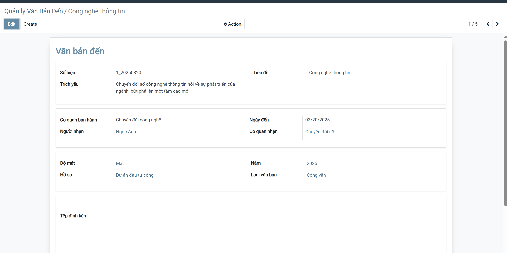
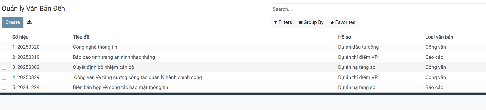
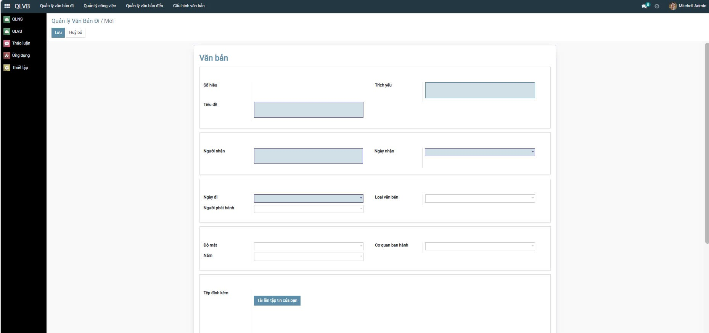
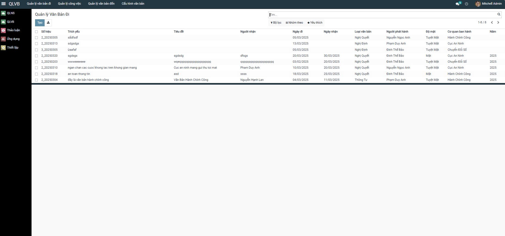
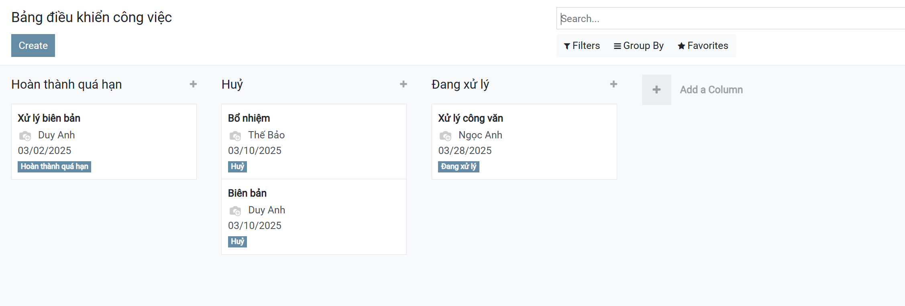
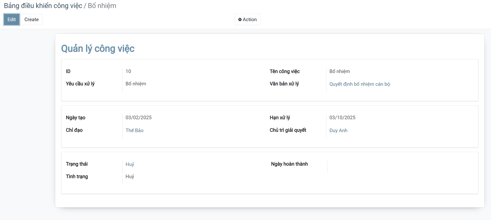
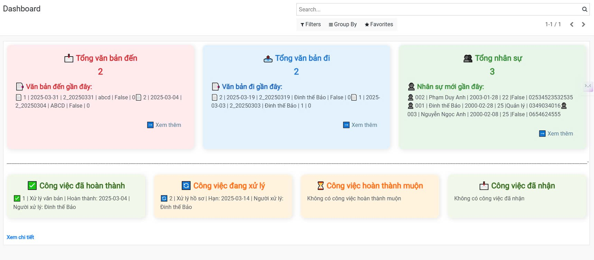
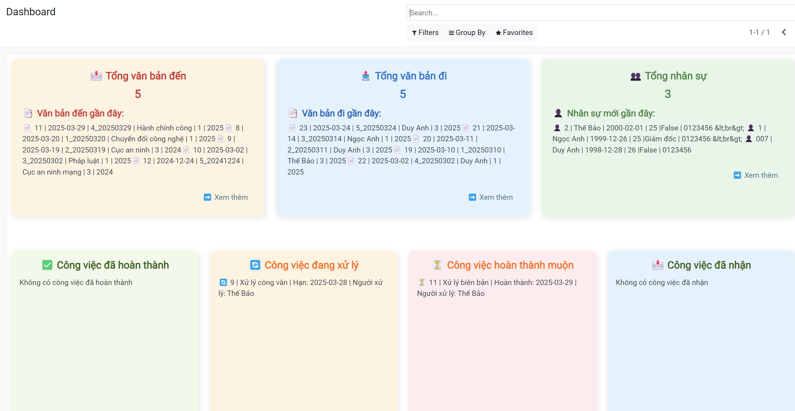
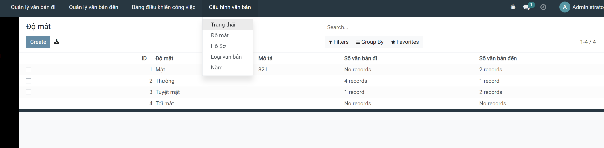

Hệ thống quản lý văn bản
Danh sách chức năng
1. Văn bản đến


2. Văn bản đi


3. Quản lý công việc


4. Dashboard


5. Một số cấu hình kèm theo:

    Độ mật,
    Trạng thái,
    Loại văn bản,
    Hồ sơ,
    Năm


---


[](https://github.com/PyCQA/bandit)


# 1. Cài đặt công cụ, môi trường và các thư viện cần thiết

## 1.1. Clone project.
```
git clone https://gitlab.com/anhlta/odoo-fitdnu.git
```
```
cd odoo-fitdnu
```

```
git checkout cntt15_04
```


## 1.2. cài đặt các thư viện cần thiết

Người sử dụng thực thi các lệnh sau đề cài đặt các thư viện cần thiết

```
sudo apt-get install libxml2-dev libxslt-dev libldap2-dev libsasl2-dev libssl-dev python3.10-distutils python3.10-dev build-essential libssl-dev libffi-dev zlib1g-dev python3.10-venv libpq-dev
```
## 1.3. khởi tạo môi trường ảo.

Thay đổi trình thông dịch sang môi trường ảo và chạy requirements.txt để cài đặt tiếp các thư viện được yêu cầu
```
python3.10 -m venv ./venv
```
```
source venv/bin/activate
```
```
pip3 install -r requirements.txt
```

# 2. Setup database

Khởi tạo database trên docker bằng việc thực thi file dockercompose.yml.
```
sudo apt install docker-compose
```
```
sudo docker-compose up -d
```

# 3. Setup tham số chạy cho hệ thống

## 3.1. Khởi tạo odoo.conf

Tạo tệp **odoo.conf** có nội dung như sau:

```
[options]
addons_path = addons
db_host = localhost
db_password = odoo
db_user = odoo
db_port = 5434
xmlrpc_port = 8069
```

# 4. Chạy hệ thống và cài đặt các ứng dụng cần thiết

Lệnh chạy
```
source venv/bin/activate
sudo docker-compose up -d
python3 odoo-bin.py -c odoo.conf -u all
python3 odoo-bin.py -c odoo.conf -u quan_ly_van_ban,nhan_su,dashboard --dev=all
```


Người sử dụng truy cập theo đường dẫn _http://localhost:8069/_ để đăng nhập vào hệ thống.

Hoàn tất
# gen key ssh
ssh-keygen
cat /home/navn/.ssh/id_rsa.pub
add to your git account
add remote by ssh link  